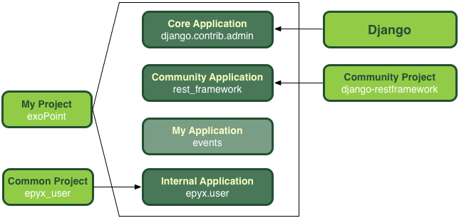

:title: Introduction to Django
:data-transition-duration: 200
:css: django.css

----

Level 1: overview
=================

.. image:: img/django.png
	:width: 800px

.. note::
	
	2 part, part 1 for non-developer, part 2 for dev
	
----

What is Django
==============

*"Django is a high-level Python Web framework that encourages rapid development and clean, pragmatic design"*

- From rapid prototyping framework...
- ... to **maintainable** large scale projects
- OpenSource project with **active community**
- Really **well documented** framework
- Django run on python and jython ( Linux, MacOS, Windows, ...)

.. note::

   - Django is not new, project started in 2004
	- Can start working with really few knowledge of python

----

Other web framework
===================

.. image:: img/ruby_on_rails_logo.jpg
	:height: 200px
	
----

Who is using Django
===================

- disqus.com
- bitbucket.org
- lanyrd.com 
- addons.mozilla.org
- The guardian.co.uk
- washingtonpost.com
- instagram
- pinterest
- rdio
- **... many many more ...**

----

:id: good-django

How "good" is django
====================

**Single machine, Intel Core i7 32Gb RAM**

- Running **24 / 7**
- **600'000** visitor / day
- **500'000** hit / hour
- **1'000** concurrent user
- **240** concurrent requests 

http://stackoverflow.com/questions/886221/does-django-scale

----

:id: django-not-good

Where django is not so "good"
=============================

- Async sockets ( WebSocket, Comet, ... )
- Not working well with **large file**
- **NoSQL** database support is tricky ( becoming better )
- Single page web application (by design)

----

Django is not a magical wand
============================

- Take care of your **database design**.
- Choose the "right" package
- Avoid doing "heavy" work on a http request
- Careful with **caching**
- **HTML** and **CSS** knowledge required...
- ... and **javascript** to enhance your pages.

.. note::
	
	- What is heavy work? 20ms?

----

Django project structure
========================

.. note::
	- The goal of this slide is to understand modularity and reut
	
----

Supported database
==================

**In django project**
	- Postgres, SQLite (dev), Oracle, Mysql

	
**3rd party**
	- Sybase, DB2, SQL Server, Firebird, ODBC, ...

Django is database **agnostic** but, your project should **not**

-----

Overall Philosophy
==================

- **MTV** *Model Template View* not an MVC framework.
- **Loose coupling**, each layer should't "know" about other
- **DRY** *Don't repeat yourself*
- **Explicit** over **implicit**

----

Components
==========

.. image:: img/overview.png
	:width: 800px

.. note::

	- This is not HTML targeted
	- View can generate JSON / XML ( rest framework )
	- Caching (careful about invalidation)
	- About WSGI ( dev connector / gunicorn / uWSGI )
	- orange dash square is the minimum server interaction

----

Other extensible components
===========================

- Admin portal
- Command line tools
- HTTP(s) middleware 
- Template tags
- Database backend
- Database router (cluster)
- File storage (static / dynamic)
- Database migration tool
- ...

.. note:: 
	- Some components are provided by 3rd party applications.
	- Application can introspect project to enhance its behavior

----

Programing language
===================

* Django framework language is **python**
* Templates are just **unicode text** with tags
	* `` ... `` 
	* ``{{ var }}`` 
* ... but template are mostly web pages 

.. note::
	- Only a Little knowledge of python is required to start working with django
	- no XML for configuration
	- no YAML, .cfg etc.. settings are in python
	- use environment variable to configure

----

:id: django-tools

Tools to work with django
=========================

* Text editor with python highlight (vi, emacs) + Shell
* jetBRAINS PyCharm
* PyDev eclipse (good luck)
* Wing IDE why not?

----

Useful Django projects
======================

- ``django-rest-framework`` ReST views on model
- ``django-social-auth`` Facebook, Twitter... authentication
- ``django-imagekit`` Automated image processing
- ``django-auth-ldap`` LDAP authentication
- ``django-debug-toolbar`` Tool bar on development page 
- ``django-cms`` CMS
- ``django-getpaid`` Payment gateway integration

https://www.djangopackages.com/ 

----

Free admin portal
=================

- **Generate** admin site based on model
- Admin portal **enhanceable** by 3rd party project

.. image:: img/admin_site.png
	
.. note:: 

	- Talk also about debug-toolbar
	- maybe demo on exopoint 2.0
	
----

Simple deployment
=================

.. image:: img/deployment.png
		:width: 800px
		
.. note:: 
	Apache to replace nginx
	Apache authentication mechanism ( delegate ) for uWSGI
	Celery + RabbitMQ to replace RQ
	SaltStack for deployment automation
	logstash - exlasticsearch - kibana ( for logging )
	demo : http://80.245.24.197:8080/

----

Deploying django
================

- exoscale
	http://www.exoscale.ch/
	
- Heroku 
	https://www.heroku.com/
	
- Google app engine
	https://developers.google.com/appengine/

- Amazon AWS
	http://aws.amazon.com/
	
----

References
==========

* Django project documentation 
	https://docs.djangoproject.com/en/dev/

* Django packages directory
	https://www.djangopackages.com/ 
	
* Django on github 
	https://github.com/django/django

* Expert book
	http://prodjango.com/

* This presentation
	https://github.com/dsaradini/django-presentation

-----

Time to start using DJANGO
==========================

.. image:: img/typing.gif

Thanks
------

