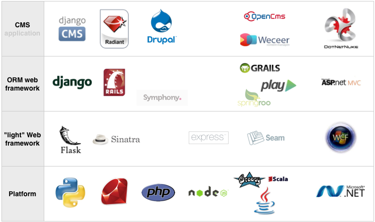

:title: Introduction to Django
:data-transition-duration: 200
:css: django.css

----

Level 1: overview
=================

.. image:: img/django.png
	:width: 800px

.. note::
	
	2 part, part 1 for non-developer, part 2 for dev
	
----

What is Django
==============

*"Django is a high-level Python Web framework that encourages rapid development and clean, pragmatic design"*

- From **rapid prototyping** application...
- ... to **maintainable** large scale projects
- OpenSource project with **active community**
- Really **well documented** framework
- Django run on python and jython ( Linux, MacOS, Windows, ...)

.. note::

   - Django is not new, project started in 2004
	- Can start working with really few knowledge of python
	- django + jython --> run on as J2EE servlet --> It's a war!
	
----

Web frameworks
==============

.. note::

	- Django has already a built-in user / group model
	- Play framework... play on both java / scala side
	- CMS have built-in mode for pages / group / glogs / ...
	- JBoss Seam is not really a lightweigth framework.
	- .NET MVC not a real ORM framework...
	- Weeceer --> grails
	- openCms --> java servlet

----

:id: good-django

Django - J2EE stack
===================

- **Application server** vs **Web framework** in the cloud.
	- **Operate all** and use what your need or...
	- ... operate only what you **use**

----

:id: django-users

Who is using Django
===================

- Instagram (instagram.com)
- Disqus (disqus.com)
- Bitbucket (bitbucket.org)
- Orange (orange.ch)
- Lanyrd (lanyrd.com)
- Mozilla (addons.mozilla.org)
- The Guardian (guardian.co.uk)
- The Washington Post (washingtonpost.com)
- Pinterest
- exodoc
- **... many many more ...**

----

:id: django-not-good

Where django is not so "good"
=============================

.. image:: img/chuck.png
	:height: 250px

- Async sockets (WebSocket, Comet, ...)
- Not working well with **large files**
- **NoSQL** database support is tricky (becoming better)
- Single page web application (by design)

----

:id: magical-django 

Django is not a magical wand
============================

- Take care of your **database design**
- Choose the "right" packages
- **Web architecture** knowledge
- Careful with **caching**
- **HTML** and **CSS** knowledge

.. note::
	
	- Web architecture / http / network / sockets / DNS
	- Request time and mesurment
	- Redis / database / file / objectstore
	- No built in support for javascript.

----

Should I use django?
====================

- **Yes** but...
- Do I need an **ORM**?
- **Multiple Page** vs **Single Page** web application?
- Do I only need **Web service** (REST/SOAP/RPC) access?
- **No** if you don't like Python!

.. note::
	- using only ORM with rest framework is not bad.... but
	- Single page application not suited for django.
	- SOAP service not well supported as server.
	
----

Overall Philosophy
==================

- **MTV** Model Template View
- **Loose coupling**, each layer should't "know" about each other
- **DRY** *Don't repeat yourself*
- **Explicit** over **implicit**

----

Supported databases
===================

**In django project**
	- Postgres, SQLite (dev), Oracle, Mysql

	
**3rd party**
	- Sybase, DB2, SQL Server, Firebird, ODBC, ...

Django is database **agnostic**, but your project should **not**

-----

Django project structure
========================

.. image:: img/project.png
	:width: 800px

.. note::
	- The goal of this slide is to understand modularity and reusability
	- Assembly of applications
	
----

Components
==========

.. image:: img/overview.png
	:width: 800px

.. note::

	- This is not HTML targeted
	- View can generate JSON / XML ( rest framework )
	- Caching (careful about invalidation)
	- About WSGI ( dev connector / gunicorn / uWSGI )
	- orange dash square is the minimum server interaction

----

Other extensible components
===========================

- Admin portal
- Authentication
- HTTP(s) middleware
- Database specific fields support
- Template tags
- Database router (cluster / load balancer)
- File storage (locate / S3 )
- Database migration tool (South)
- ...

.. note:: 
	- Some components are provided by 3rd party applications.
	- Application can introspect project to enhance its behavior

----

:id: programming

Programing language
===================

* Django framework language is **python**
* Templates are just **unicode text** with tags
	* `` ... `` 
	* ``{{ var }}`` 
* ... but templates are mostly web pages 

.. image:: img/html_css.jpeg
	:height: 200px
	
	
.. note::
	- Only a Little knowledge of python is required to start working with django
	- no XML for configuration
	- no YAML, .cfg etc.. settings are in python
	- use environment variable to configure
	- Javascript / Sass / Less / jquery / angularjs / ....

----

Useful Django projects
======================

- ``django-rest-framework`` ReST views on model
- ``django-social-auth`` Facebook, Twitter... authentication
- ``django-imagekit`` Automated image processing
- ``django-auth-ldap`` LDAP authentication
- ``django-debug-toolbar`` Tool bar on development page 
- ``django-cms`` CMS
- ``django-getpaid`` Payment gateway integration

https://www.djangopackages.com/

.. note:: 

	- More than 1000 packages available

----

Free admin portal
=================

- **Generate** admin site based on model
- Admin portal **enhanceable** by 3rd party projects

.. image:: img/admin_site.png
	
.. note:: 

	- Talk also about debug-toolbar
	- maybe demo on exopoint 2.0
	
----

:id: django-security

Security
========

- Hard to make things right for newbie

- Built in good practices
	- **csrf**: Enable by default
	- **xss**: <script> auto escaping
	- **sql injection**: no raw query
	- **clickjacking** protection ``X-Frame-Options`` 

- Check up for your web site
	- http://ponycheckup.com/

----

First experience with django
============================

- Easy newbie member ramp up
	- **loose coupling** between layers
	- Simple HTML template

- Explicit code writing and patterns
	- Only **one way** to do something
	- **Repeatable** pattern

----

Simple deployment
=================

.. image:: img/deployment.png
		:width: 800px
		
.. note:: 
	Apache to replace nginx
	Apache authentication mechanism ( delegate ) for uWSGI
	Celery + RabbitMQ to replace RQ
	SaltStack for deployment automation
	logstash - exlasticsearch - kibana ( for logging )
	demo : http://80.245.24.197:8080/

----

Deploying django
================

- exoscale
	http://www.exoscale.ch/
	
- Heroku 
	https://www.heroku.com/

- dotCloud
	http://docs.dotcloud.com/

- appfog
	https://www.appfog.com/

- Google app engine
	https://developers.google.com/appengine/

- Amazon AWS
	http://aws.amazon.com/

----

References
==========

* Django project documentation 
	https://docs.djangoproject.com/en/dev/

* Django packages directory
	https://www.djangopackages.com/ 
	
* Django on github 
	https://github.com/django/django

* Expert book
	http://prodjango.com/

* This presentation
	https://github.com/dsaradini/django-presentation

-----

:id: the-end

Time to start using DJANGO
==========================

.. image:: img/typing.gif
	:width: 400px

.. image:: img/django_pony.png
	:width: 400px

Thanks
------

