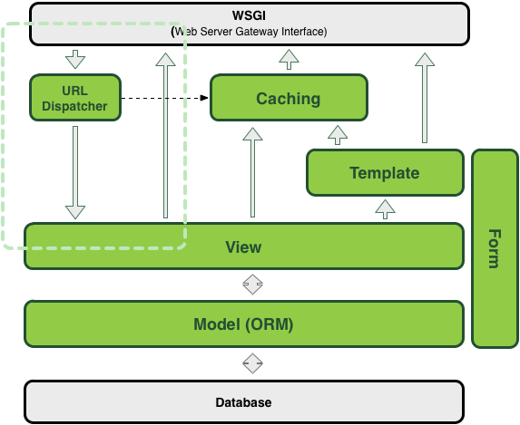
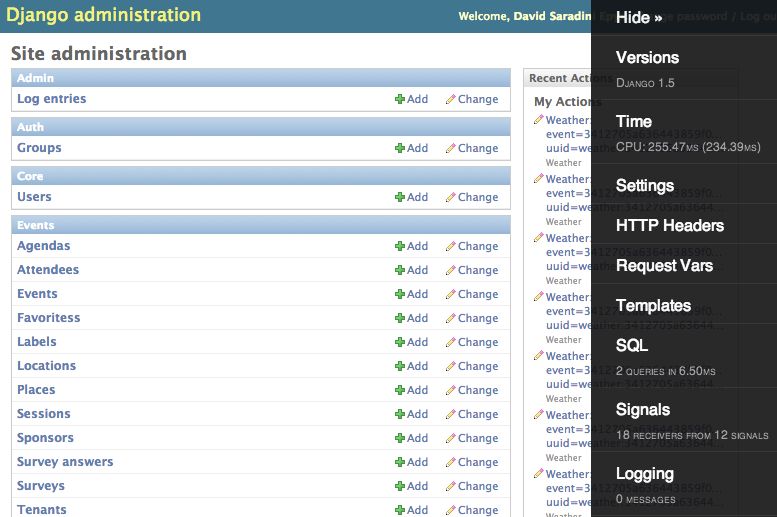
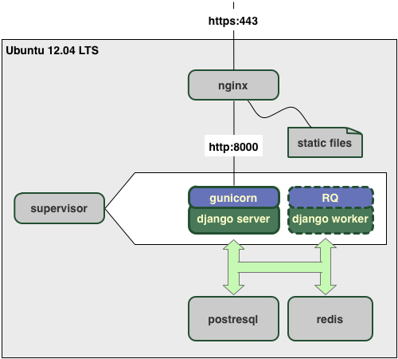
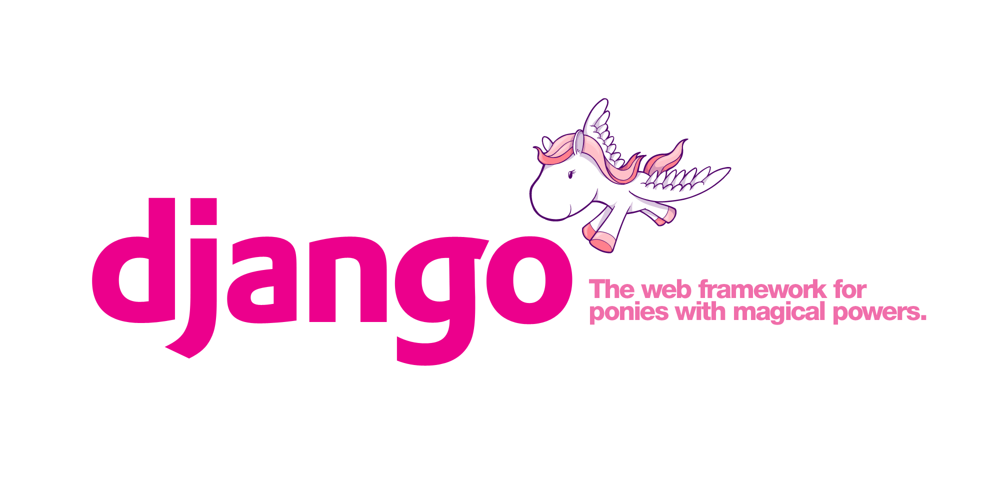
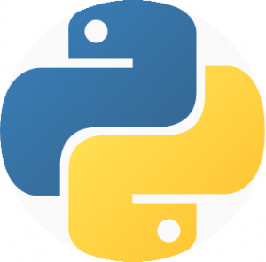

:title: Introduction to Django
:data-transition-duration: 200
:css: django.css

----

Level 1: overview
=================

.. image:: img/django.png
	:width: 800px

.. note::
	
	2 part, part 1 for non-developer, part 2 for dev
	
----

What is Django
==============

*"Django is a high-level Python Web framework that encourages rapid development and clean, pragmatic design"*

- Mature in production ( since July 2005 )
- OpenSource project with active community
- Easy learning web framework 
- Really well documented framework
- Rapid prototyping framework
- Django run on python and jython ( Linux, MacOS, Windwows, ...)

.. note::

   - Django is not new, project started in 2004
	- Can start working with really few knowledge of python

----

Other web framework
===================

- JVM
	- Grails (Groovy) *SpringSource*
	- Play! ( scala ) 
	- Spring Roo (java) *SpringSource*
- Ruby
	- Ruby on Rails

- PHP, ASP.NET, Perl, ...

----

Who is using Django
===================

- disqus.com
- bitbucket.org
- lanyrd.com 
- addons.mozilla.org
- The guardian.co.uk
- washingtonpost.com
- instagram
- pinterest
- rdio
- **... many many more ...**

----

How "good" is django
====================

**Single machine, Intel Core i7 32Gb RAM**

- Running **24 / 7**
- **600'000** visitor / day
- **500'000** hit / hour
- **1'000** concurrent user
- **240** concurrent requests 

http://stackoverflow.com/questions/886221/does-django-scale

----

Where django is not so "good"
=============================

- Async sockets ( WebSocket, Comet, ... )
- Not working well with large file upload / download
	- object store wanted
- NoSQL database support is tricky ( becoming better )

----

Django is not a magical wand
============================

- Careful database design.
- Choose the right "package"
- Avoid doing "heavy" work on a http request
- Careful with caching
- Serve static file outside django

.. note::
	
	- What is heavy work? 20ms?
	
----

	

Django project structure
========================

.. image:: img/project.png
	:width: 1024px

.. note::
	- The goal of this slide is to understand modularity and reut
	
----

Supported database
==================

**In django project**
	- Postgres, SQLite (dev), Oracle, Mysql

	
**3rd party**
	- Sybase, DB2, SQL Server, Firebird, ODBC, ...
	

Database migration tool available

----

Components
==========

.. note::

	- This is not HTML targeted
	- View can generate JSON / XML ( rest framework )
	- Caching (careful about invalidation)
	- About WSGI ( dev connector / gunicorn / uWSGI )
	- orange dash square is the minimum server interaction

----

Other components
================

- Admin portal
- Command line  
- HTTP(s) middleware 
- Template tags
- Database backend
- Database router
- File storage
- ...

.. note:: 
	- Some components are provided by 3rd party applications.
	- Application can introspect project to enhance its behavior

----

Useful Django projects
======================

- ``django-rest-framework`` ReST views on model
- ``django-social-auth`` Facebook, Twitter... authentication
- ``django-imagekit`` Automated image processing
- ``django-auth-ldap`` LDAP authentication
- ``django-debug-toolbar`` Tool bar on development page 
- ``django-cms`` CMS by "divio" Zurich company
- ``django-getpaid`` Payment gateway integration

https://www.djangopackages.com/ 

----

Free admin portal
=================

- Generate admin site based on model
- Fully customizable front-end
- Admin portal enhanceable by 3rd party project

	
.. note:: 

	- Talk also about debug-toolbar
	- maybe demo on exopoint 2.0
	
----

Typical dev deployment
======================

		
.. note:: 
	Apache to replace nginx
	Apache authentication mechanism ( delegate ) for uWSGI
	Celery + RabbitMQ to replace RQ
	SaltStack for deployment automation
	logstash - exlasticsearch - kibana ( for logging )
	demo : http://80.245.24.197:8080/

----

Level 2: Inside django
========================

	
----

Django is python
================

----

Python types
------------

.. code:: python

		x = 10 # int (32-bits)
		x = 20L # long (only limited by memory)
		y = 12.5 # float ( equivalent to 'C' double )
		c = 3 + 1j # Complex numbber ( float )
		b = False # Boolean
		s = "Hello" # string ( python2: non unicode, python3: unicode)
		s = u"Hello" # string unicode ( python 2 et python 3.3 )
		t = (10, "hello") # tuple ( immutable list )
		a = [20, "hello"] # list ( mutable )
		d = {'key': 'my_value'} # dictionary
		def do_something(): return "Done"
		f = lambda x: x**2 # function
		f = do_something # function

		http://docs.python.org/2/library/types.html

----

Function
--------

.. code:: python

	def my_function(name, age=8):
	   print "My name is {0} and I am {1} years old".format(
	      name, age
	   )
		
	my_function('django')
	# My name is django and I am 8 years old
	my_function('John', 20)

.. note::
	Ask who already used python
	
	
----

Function arguments
------------------

.. code:: python

	def my_function(*args, **kwargs):
	   """
	   This is a little help for this function
	   """
	   print "args are: {0}".format(args)
		print "kwargs are: {0}".format(kwargs)
	
	
	my_function('test', position=10, other='hello')
	# args are: ('test',)
	# kwargs are: {'position': 10, 'other': 'hello'}
	print my_function.func_doc
	# 
	#  This is a little help for this function
	#

	my_kwargs = {'name': 'django'}
	my_args = [10,'hello']
	my_function(*my_args, **my_kwargs)
	
----

Duck typing
-----------

*When I see a bird that walks like a duck, swims like a duck and quacks like a duck, I call that bird a duck.*

.. code:: python

	class MyDictionary(object):
	   def __getitem__(self, key):
	   def __setitem__(self, key, value):
	   def __delitem__(self, key):
	
	x = my_dict['my_key']
	
	
	class Container(object):
		def __contains__(self, value):

	if 'django' in my_container:
	   print "Found django in my saloon"
	
	class GetFallback(object):
	   def __getattr__(self, name):

	my_object.unknown_atribute
	
.. note::

	__init__ is pronounced "dunder init"

----

Python class
------------

.. code:: python

		class Person(object):
		  def __init__(self, name, age):
		    self.name = name
		    self.age = age

		class Developer(Person):
		  skills = [] #  NOT A GOOD idea (shared by instances)
		  def __init__(self, name, age, skills=None):
		    super(Developer, self).__init__(name,age)
		    if skills is None:
		      self.skills = []
		    else:
		      self.skills = ["skill:{0}".format(s) for s in skills]

		  def __str__(self):
		    return "{0} / {1} / {2}".format(
		      self.name, self.age, self.skills
		    )

		john = Developer("John Doe", 33, ("python", "java"))
		print john
		# John Doe / 33 / ['skill:python', 'skill:java']

.. note::

	class attribute are bad, each instance reference it. copy should be handled in __init__

----

Multiple Inheritance
====================

.. code:: python

   class A(object):
     def do_it(self):
       print "Call A"
    
    
   class B(object):
     def do_it(self):
       print "Call B"
    
   class C(A, B):
     def do_it(self):
       super(C, self).do_it()
       B.do_it(self)
       print "Call C"
    
   c = C()
   c.pony()
   # Call A (first in inheritance list)
   # Call B (explicitly called)
   # Call C (it's a C class after all)

----

Callable
--------

.. code:: python

	class Talker(object):
	   def __init__(self, name):
		
	   # this method makes this class callable
	   def __call__(self, message="nothing"):
	      print "{0} just said: '{1}'".format(self.name, message)

	talker = Talker("Django")
	talker()
	# Django just sait 'nothing'
	talker("Cora, say goodbye to Miss Laura.")
	# Django just said 'Cora, say goodbye to Miss Laura.'
	print "Is callable {0}".format(callable(talker))
	# Is callable True
	
----

Decorators
----------

Decorator are used to "alter" functions at initialization

Decorator are functions returning another function

.. code:: python

   def decorator(func):
      func.is_decored = True
      return func

   @decorator
   def my_function():
      pass

   print my_function.is_decoratod
   # True

   # Decorator can have options
   @check_role(role=ADMIN)
   def display_my_page(*args):
      pass
	
----

Python good practices
=====================

- PEP-8: all about code formatting
- PEP-20: all about python philosophy
- have tests and run them
- virtualenv to isolate development
- use ``pip`` (Python package installer)

.. code:: 
	
	$ python
	...
	>>> import this

----

Setting up a django project
===========================

.. code::

	django-admin.py startproject facile_backlog
	
	./facile_backlog/
		manage.py
		facile_backlog/
			__init__.py
			settings.py
			urls.py
			wsgi.py

.. note::

	the directory containing settings is called also "site"
	
----

Setting up a application
========================

.. code::

	python manage.py startapp backlog

	./facile_backlog/
		manage.py
		facile_backlog/
			__init__.py
			settings.py
			urls.py
			wsgi.py
		backlog/
			__init__.py
			models.py
			views.py

.. note::

	What is an application
	
----

Settings
========

.. code::

	./facile_backlog/settings.py
	
.. code:: python

   DATABASES = {
      'default': {
         'ENGINE': 'django.db.backends.sqlite3'
         'NAME': 'database.sqlite',
      }
   }
   ...
   INSTALLED_APPS = (
      ...,
      'django.contrib.admin',
      'facile_backlog.backlog'
   )

----

The model
=========

.. code::

	./facile_backlog/backlog/models.py
	
.. code:: python

	from django.conf import settings
	from django.db import models
	from django.utils.translation import ugettext_lazy as _
	
		
	class Project(models.Model):
	   name = models.CharField(_('Name'), max_length=1023)
	   active = models.BooleanField(default=True)
	   description = models.TextField(_('Description'),
	   help_text=MARKDOWN,
	      blank=True)
	   class Meta:
	      ordering = ('name',)

	class Backlog(models.Model):
	   name = models.CharField(_('name'), max_length=1023)
	   project = models.ForeignKey(Project, 
	      verbose_name=_('Project'),
	      related_name='backlogs')
		
		
.. note:: 
	
	- Explain about User application.
	- localisation ( _() )
	- reference namming by Class or Application name

----

Play with ORM
=============

.. code:: python

   from facile_backlog.backlog import Project
	
   project = Project(name="First project")
   project.description = "My first project created with django"
   project.save()
	
   all_active_project = Project.objects.filter(active=True)
   for project in all_active_project:
      print "Project: {0}".format(project.name)

	
----

More fun with ORM
=================

.. code:: python

   from facile_backlog.backlog import Backlog
	
   backlog = Backlog(project=project, name="Main Backlog")
   backlog.save()
	
   for project in Project.objects.all():
      print "Project: {0} with {1} backlogs".format(
            project.name, 
            project.backlogs.count()
         )

	
----

ORM abilities
-------------

- Transactions ``@transaction.atomic``
- Rich filter interface
- Bulk insert ``Backlog.objects.bulk_create([])``
- Raw sql query ``Project.objects.raw('SELECT * FROM ...')``
- Index management
- Mutli database
- Pagination using ``django.core.paginator.Paginator``

https://docs.djangoproject.com/en/dev/topics/db/

----

URL resolver
============

- Ordered list or **url pattern** expressed using **regexp**

- URL patterns are resolved in **order**, first match is used

- Each pattern point to **one** view

- A view can be used by **multiple** pattern

.. note::

	Careful about mutiple pattern on 1 view, view are stateless
	
----

URL resolver - project
======================

.. code::
	
	./facile_backlog/urls.py
	
.. code:: python

	from django.conf.urls import patterns, include, url
	from django.contrib import admin
	
	admin.autodiscover()
	
	robots = lambda _: HttpResponse('User-agent: *\nDisallow:\n',
	     mimetype='text/plain')
	
	urlpatterns = patterns('',
	   url(r'^robots.txt$', robots),
	   url(r'facile_backlog/', include('facile_backlog.backlog.urls')),
	   url(r'^admin/doc/', include('django.contrib.admindocs.urls')),
	   url(r'^admin/', include(admin.site.urls)),
	)
	
.. note::

	patterns(prefix, list_urls) --> prefix all url names
	

----

URL resolver - application
==========================

.. code::
	
	./facile_backlog/backlog/urls.py
	
.. code:: python

	from django.conf.urls import patterns, include, url
	from .views import project_list, home, project_detail
		
	urlpatterns = patterns('',
	   url(r'^$', home, name="home"),
	   url(r'projects/$', project_list, name="project_list"),
	   url(r'projects/(?P<project_id>[\w:@\.-]+/$', 
	      project_detail, 
	      name="project_detail"),
	   url(r'projects/(?P<project_id>[\w:@\.-]+/more/$', 
	      project_detail,
	      {'more_info': True},
	      name="project_more_detail"),
	)

----

URL resolver in code
====================

Naming url pattern allows easy creation of url in code

example to get URL for a given project object

.. code:: python

	from django.core.urlresolvers import reverse, reverse_lasy
	
	url = reverse('project_detail', {'project_id' : 120})
	# /facile_backlog/backlog/projects/120
	
	url = reverse_lasy('project_detail', {'project_id' : 120})
	# resolved when 'url' is used

----

Views
=====

View is a 'callable'
   ``lambda`` / ``function`` / object with ``__call__`` method
	
Function takes at less an ``HttpRequest`` object as **first argument** and should return a ``HttpResponse`` or raise an **exception**

.. code:: python

   from django.http import HttpResponse
   from django.shortcuts import redirect
	from django.core.urlresolvers import reverse
	
   import datetime

   def display_time(request):
      now = datetime.datetime.now()
      html = "<html><body>It is now {0}.</body></html>",format(now)
      return HttpResponse(html)

   def redirect_me(request):
      return redirect(reverse('my_named_url'))

.. note::

	redirect can redirect to another view redirect(view_name, kwargs)
	redirect to URL use 302 code
	redirect to view does not change the URL
	
----

Views with templates
====================

.. code::
	
	./facile_backlog/backlog/views.py

.. code:: python
	
	from .models import Project
	
   def project_list(request):
      projects = Project.objects.all()
      # ./backlog/templates/project_list.html
      t = loader.get_template('backlog/project_list.html')
      c = Context({'projects': projects})
      return HttpResponse(t.render(c),
         content_type="application/xhtml+xml")

   def project_list(request):
      return render_to_response("backlog/project_list.html",{
            'projects': Project.objects.all()
         }

----

Class Based View
================

- Generate views using class definition
- ``django.views.generic.View`` is the root class

.. code:: python

	# views.py
	from django.views.generic import TemplateView

	class AboutView(TemplateView):
	   template_name = "about.html"
		
	   def get_context_data(self, **kwargs):
	      context = super(AboutView, slef).get_context_data(**kwargs)
	      context['my_info'] = u"My info"
	      return context
	
	# urls.py
	from django.conf.urls import patterns
	
	urlpatterns = patterns('',
	   (r'^about/$', AboutView.as_view()),
	)
	
----

Class based generic views
=========================

Hierarchy of **class based view** to help dealing with model.

- ``DetailView`` fetch given object from model, handle not found,...
- ``ListView`` display a list of model object
- ``CreateView``, ``DeleteView``, ``UpdateView`` CrUD on model
- ``FormView`` generic form applied on model

----

View Mixin
==========

- Abstract class that provide a functionality 
- Used to **compose** custom views

.. code:: python

	class django.views.generic.base.ContextMixin(object)
	   def get_context_data(**kwrage):

	class django.views.generic.base.TemplateResponseMixin(object)
	   template_name = None
	   response_calss = TemplateResponse
	   content_type = settings.DEFAULT_CONTENT_TYPE
	
	   def render_to_response(self, context, **kwrage):      
	   def get_template_name(self):
		   
----

Template
========

----

Form
====

----

Admin
=====

----

Tests
=====

----

Database schema migration
=========================

* South (http://south.aeracode.org/)
* Will become part of django core.

----

The End
=======

or just the beginning taming django?